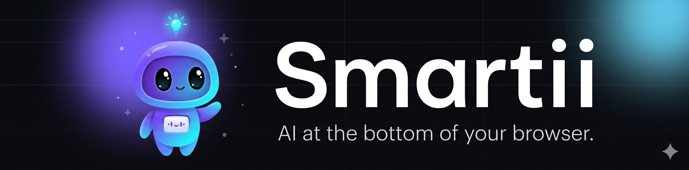

<p align="center">
  
</p>

# Smartii

> AI at the bottom of your browser. Press a key, screenshot the screen, get the answer.

Smartii is an unpacked Chrome extension that summons a small assistant bar at
the **bottom-middle** of any page when you hit **Ctrl+Shift+S**. From there
you can type a question, or press **Ctrl+Shift+Enter** to screenshot the
whole visible page and let your chosen AI solve whatever is on it — a
homework question, a stack trace, a UI puzzle, anything.

It works with **free** providers (Gemini, Groq, OpenRouter free models,
Hugging Face) and **paid** ones (Claude, ChatGPT, Perplexity). Your API key
lives only in your browser's sync storage. Smartii has no server.

---

## Install (1 minute)

Smartii is shipped as an *unpacked* extension. Pick whichever flow you prefer.

### 🪄 Windows one-click installer (recommended on Windows)

Download **`Install-Smartii.exe`** from the [latest release](https://github.com/platret/Smartii/releases/latest) and double-click.

The installer detects every Chromium browser on your machine (Chrome, Edge,
Brave, Vivaldi, Opera, Opera GX, Arc, Chromium, Yandex), downloads the
latest Smartii zip to `%LOCALAPPDATA%\Smartii\`, copies that path to your
clipboard, and opens the right `chrome://extensions/` page in the browser
you choose. You finish with one click — *Load unpacked* → `Ctrl+V` → Enter.

> Source: [`installer/Install-Smartii.ps1`](installer/Install-Smartii.ps1). The
> .exe is the same script bundled with [ps2exe](https://github.com/MScholtes/PS2EXE);
> nothing more. Audit it, then run.

### 🛠 Manual (any OS)

1. Download the **`Smartii-v*.zip`** from the [latest release](https://github.com/platret/Smartii/releases/latest) and unzip — or `git clone https://github.com/platret/Smartii.git`.
2. Open Chrome (or any Chromium browser — Edge, Brave, Arc, Opera) and go to
   `chrome://extensions`.
3. Turn **Developer mode** on (toggle, top-right).
4. Click **Load unpacked** and pick the `Smartii` folder.
5. The settings page opens automatically. Pick a provider, paste your API
   key, save.

To update later: `git pull` (or re-run the installer / re-download the zip)
and click the ↻ button on the extension card.

---

## Usage

| Shortcut                          | Action                                                     |
| --------------------------------- | ---------------------------------------------------------- |
| `Ctrl + Shift + S`                | Toggle Smartii on the active tab                           |
| `Ctrl + Shift + Enter`            | Screenshot the visible screen + solve immediately          |
| `Enter` in the input              | Send your question (uses page text as context if empty)    |
| `Ctrl + Enter` in the input       | Send your question **and** attach a screenshot             |
| `Esc`                             | Close the bar                                              |

Change any shortcut at `chrome://extensions/shortcuts`.

The bar appears in the **bottom middle** of the page, either as a **solid
dark card** or as a **clear / glass** card (configurable in settings).

---

## Providers — where to get a key

Smartii supports a mix of free and paid providers. **Start with a free one**
if you've never used an AI API.

### Free / has free tier

| Provider          | Free?                           | Sign up                                                                          | Get a key                                                              | Notes                                                            |
| ----------------- | ------------------------------- | -------------------------------------------------------------------------------- | ---------------------------------------------------------------------- | ---------------------------------------------------------------- |
| **Google Gemini** | ✅ Generous free tier            | [aistudio.google.com](https://aistudio.google.com/)                              | [Get API key](https://aistudio.google.com/app/apikey)                  | Best free vision model. Recommended starter.                     |
| **Groq**          | ✅ Free tier                     | [console.groq.com](https://console.groq.com/)                                    | [console.groq.com/keys](https://console.groq.com/keys)                 | Extremely fast. Pick a `vision-preview` model for screenshots.   |
| **OpenRouter**    | ✅ Many `:free` models           | [openrouter.ai](https://openrouter.ai/)                                          | [openrouter.ai/keys](https://openrouter.ai/keys)                       | One key, dozens of models. Pick anything ending in `:free`.      |
| **Hugging Face**  | ✅ Free tier (rate-limited)      | [huggingface.co/join](https://huggingface.co/join)                               | [Tokens](https://huggingface.co/settings/tokens)                       | Text-only on the free Inference API. Create a *Read* token.      |

### Paid

| Provider           | Sign up                                                       | Get a key                                                                        | Notes                                          |
| ------------------ | ------------------------------------------------------------- | -------------------------------------------------------------------------------- | ---------------------------------------------- |
| **Anthropic Claude** | [console.anthropic.com](https://console.anthropic.com/)     | [Settings → API keys](https://console.anthropic.com/settings/keys)               | Strongest reasoning + vision. No free tier.   |
| **OpenAI ChatGPT** | [platform.openai.com](https://platform.openai.com/)           | [API keys](https://platform.openai.com/api-keys)                                 | `gpt-4o-mini` is the cheapest vision option.   |
| **Perplexity**     | [perplexity.ai/settings/api](https://www.perplexity.ai/settings/api) | Same page                                                                | Web-grounded answers. No image input.          |

> Tip: All keys are stored locally with `chrome.storage.sync`. You can switch
> providers anytime from the settings page (click the extension icon).

---

## Configuration

Click the Smartii icon in the toolbar (or use `chrome://extensions` →
*Details* → *Extension options*) to open the settings page. You can change:

- **Provider** and **model**
- **API keys** (one per provider, all kept locally)
- **Background** — solid dark or clear/glass
- **Accent color**
- **Width**, **corner radius**, **distance from bottom**
- **System prompt** (advanced)

---

## How it works

```
chrome.commands  ─► background.js  ─► content.js (injects bar)
                          │
                          ├─► chrome.tabs.captureVisibleTab  (screenshot)
                          └─► fetch(provider API)            (solve)
```

- **`manifest.json`** — MV3 manifest. Declares the `toggle-smartii` and
  `solve-now` commands plus `<all_urls>` host permissions for the screenshot.
- **`background.js`** — service worker. Owns the keybind handler, the
  `captureVisibleTab` screenshot, and the outbound HTTP call.
- **`content.js` + `content.css`** — injected into every page. Builds the
  floating bar, handles input/output, talks to the background worker.
- **`options.html` + `options.js` + `options.css`** — settings page with the
  full provider onboarding flow.
- **`lib/providers.js`** — single source of truth for every provider:
  endpoint, models, vision support, signup/key URLs, and request builder.

No build step. No bundler. Edit a file, reload the extension.

---

## Privacy

- Smartii has **no backend**. Your screenshots and prompts go directly from
  your browser to whichever AI provider you've configured.
- API keys are stored in `chrome.storage.sync` (encrypted, synced across
  your signed-in Chrome profiles).
- The `<all_urls>` host permission is required by Chrome to (a) inject the
  bar on the page and (b) screenshot the visible tab. Smartii reads page
  text only when **you** invoke it and only sends it to the provider you
  chose.

---

## Roadmap

- [ ] Streaming responses
- [ ] Conversation history per tab
- [ ] Region screenshot (drag-to-select)
- [ ] Custom keybind in the settings UI (currently `chrome://extensions/shortcuts`)
- [ ] Firefox port

---

## Logo & banner

The mascot logo (`icons/logo.png`) and hero banner (`icons/banner.png`) are
generated. The repo also includes the prompts used to make them in
[`PROMPTS.md`](PROMPTS.md) — useful if you want to remix the artwork in your
own style. The toolbar icons (`icon16/32/48/128.png`) are produced from
`logo.png` with high-quality bicubic downscaling.

---

## License

[MIT](LICENSE).
